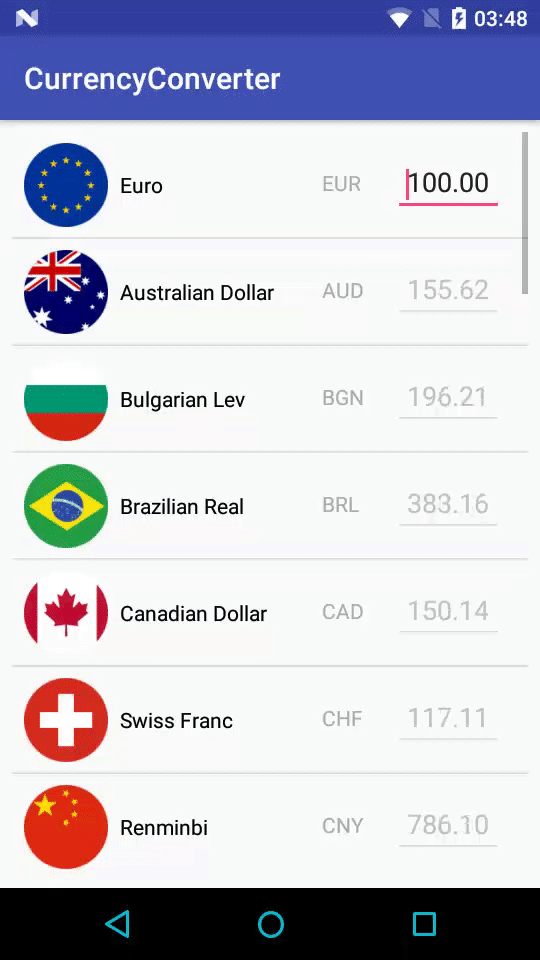

Currency Converter
================

Simple Real-time Currency Converter done entirely in *[Kotlin](https://developer.android.com/kotlin/index.html)*

----------
Using:
 - Retrofit2 for the Api
 - ViewModel/LiveData using the [Architecture Components](https://developer.android.com/topic/libraries/architecture/viewmodel.html)
 - RecyclerView with DiffUtil for smooth UI updates

----------

